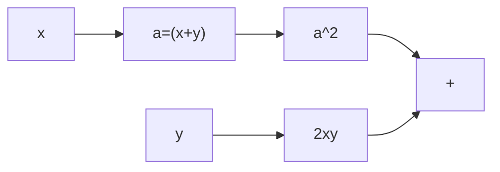
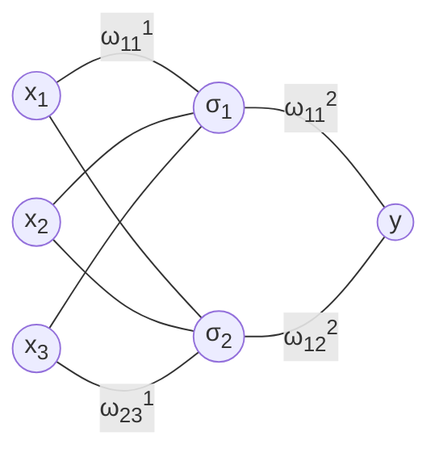

# AI

Вычислительный граф позволяет производить вычисления посредством графа.
Общая идея - представить целевую функцию набором элементарных математических операций

`+ - * / sin cos exp log sqrt`

f(x,y) = (x + y)<sup>2</sup> + 2xy



Любую нейронную сеть можно представить в виде вычислительного графа  
`Простая полносвязная трехслойная нейронная сеть:`

```
x - значение на входе нейрона
ω - вес связи омега, где значение умножается на вес
σ - нейрон, где суммируются значения (сумма значений сигма), после чего сумма проходит через функцию g активации нейронов
```

σ<sub>1</sub> =
ω<sub>11</sub><sup>1</sup> * x<sub>1</sub> +
ω<sub>12</sub><sup>1</sup> * x<sub>2</sub> +
ω<sub>13</sub><sup>1</sup> * x<sub>3</sub>  
σ<sub>2</sub> =
ω<sub>21</sub><sup>1</sup> * x<sub>1</sub> +
ω<sub>22</sub><sup>1</sup> * x<sub>2</sub> +
ω<sub>23</sub><sup>1</sup> * x<sub>3</sub>

y<sub>1</sub> = g(σ<sub>1</sub>)  
y<sub>2</sub> = g(σ<sub>2</sub>)

Где ω<sub>23</sub><sup>1</sup>:

* ω - вес связи
* <sub>2</sub> - в какой нейрон направлена связь
* <sub>3</sub> - из какого нейрона выходит связь
* <sup>1</sup> - номер итерации (?)



